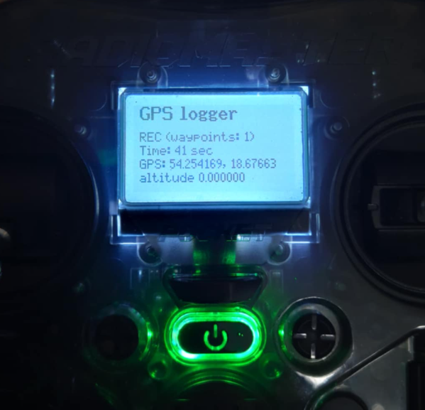
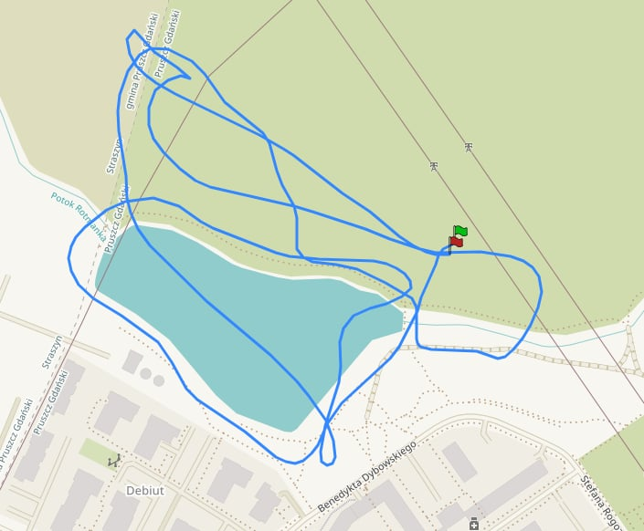

# GPS logger for EdgeTX
For bw screen radios that can use telemetry scripts.

## INSTALLATION AND USAGE
1. Copy ```gpslog.lua``` to ```/SCRIPTS/TELEMETRY```.
2. In model setup / display select screen -> script -> gpslog.
3. GPS logging will be automatic during arm - disarm period.
4. If GPS fix is acquired, GPX logs will be saved to ```/LOGS```.

If you get an error, go to ```TELEMETRY``` tab and use ```Sensors``` / ```Discover new```, then restart the radio.

```ELRS```: if acquired tracks are not very detailed (especially if you are using a slower packet rate), go to ExpressLRS configurator app and increase ```telemetry ratio```.

Make sure ```telemetry``` is enabled in Betaflight ```receiver``` tab.

Tested on RadioMaster Pocket / GX12, ExpressLRS / Crossfire, and M8 / M10 / M100 GPS.

You can freely use and modify this script.





